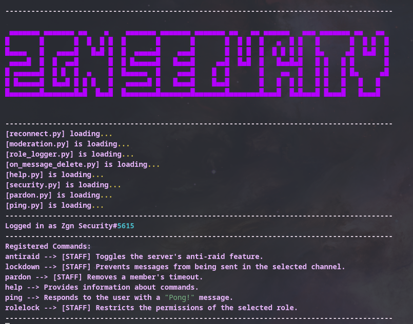
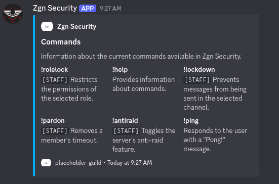

# zgn-security
This is a discord bot that protects your server from raiders & bots, also some moderation features inside as well.

This bot is a private guild bot, meaning the bot only works on one specific guild.

# Commands
    lockdown --> [STAFF] Prevents messages from being sent in the selected channel.
    antiraid --> [STAFF] Toggles the server's anti-raid feature.
    help --> Provides information about the commands.
    ping --> Responds to the user with "Pong!"
    pardon --> [STAFF] Removes a member's timeout.
    rolelock --> [STAFF] Restricts the permissions of the selected role.

# Screenshots

